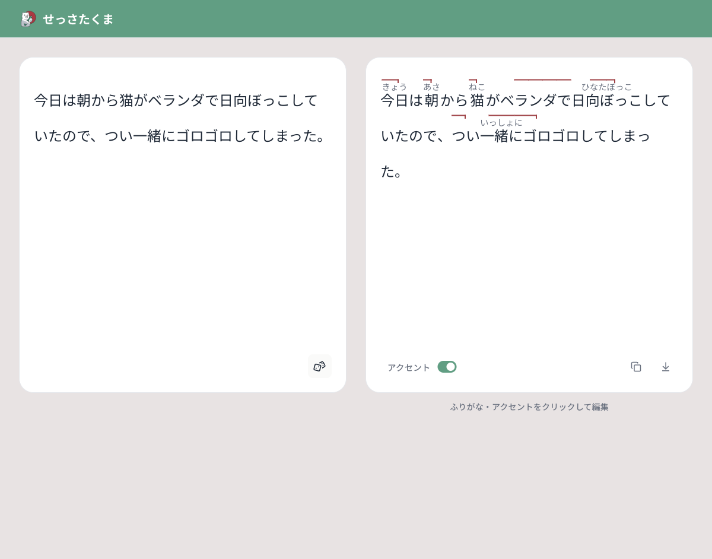

# Accent Marker

A web tool for automatic Japanese furigana and accent markings to plain text, to help Japanese learners to improve their speaking and reading skills.



## What It Does

- Analyzes Japanese text and renders furigana with pitch-accent markings automatically
- Lets you click the generated result to adjust furigana and accent output manually
- Supports plain-text copy, Markdown export, and image download for study notes

## How It Works

1. Paste or generate a Japanese sentence.
2. Let the app analyze and mark the text.
3. Tweak furigana or accent presentation directly in the result panel if needed.
4. Export the formatted output in the format you need.

## Quick Start (Internal Development)

Install dependencies with [bun](https://bun.com/):

```bash
bun i
```

Start the local dev server:

```bash
bun dev
```

## Local API Setup (Internal Development)

Production on Vercel manages the upstream API key server-side.

If you run the app locally with `bun dev`, the Next.js route handler for `/api/mark-accent/stream` needs an API key in `.env`:

```bash
MARK_ACCENT_API_KEY=<your_api_key>
```

`VITE_X_API_KEY` is still accepted for backward compatibility, but `MARK_ACCENT_API_KEY` is the preferred variable name.
